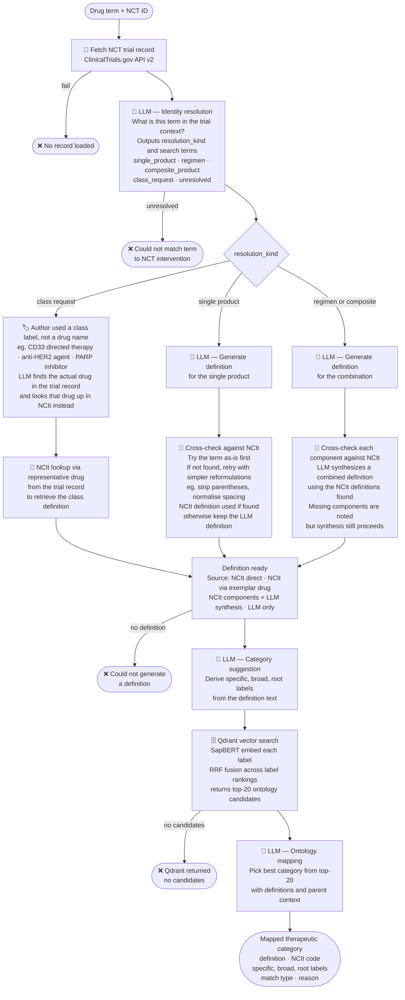

# NCT Therapeutic Category Mapper

A pipeline that maps drug / intervention terms from ClinicalTrials.gov (NCT) studies to
**therapeutic categories** and **drug classes** in an ontology hierarchy, using **SapBERT**
embeddings for semantic retrieval and an **LLM** for definition generation and final ontology
mapping.

> This work was developed within the **AI & NLP Division at QIAGEN**.

The repository contains three parts:

| Part | Location | Purpose |
|---|---|---|
| Web UI | `frontend/` | Vue 3 + Vite single-page app |
| API + pipeline | `src/` | FastAPI server, retrieval, LLM orchestration |
| One-off scripts | `scripts/` | Model download + Qdrant population |

---

## Architecture



| Component | Technology |
|---|---|
| Embedding model | SapBERT (`cambridgeltl/SapBERT-from-PubMedBERT-fulltext`) |
| Vector database | Qdrant v1.19 |
| LLM client | OpenAI-compatible API |
| API server | FastAPI + Uvicorn (port 8000) |
| Embedding server | FastAPI + Uvicorn (port 7997, internal) |
| Web UI | Vue 3 + Vite (served by FastAPI at `/`) |

---

## Prerequisites

- [Docker](https://docs.docker.com/get-docker/) and Docker Compose
- [uv](https://github.com/astral-sh/uv) — used to create the local environment and run scripts
- [Node.js](https://nodejs.org/) 20+ — only needed if you want to develop the web UI locally
- A `.env` file in the project root (created in Step 0 below)

---

## How to run

### Step 0 — Configure the environment

Create a `.env` file in the project root **before** building or starting anything —
`docker compose` loads it via `env_file`:

```env
# ── LLM (OpenAI-compatible endpoint) ──────────────────────────────────────
LLM_BASE_URL=https://your-llm-endpoint/v1
LLM_API_KEY=your-api-key
LLM_MODEL=your-model-name

# ── Qdrant collections ────────────────────────────────────────────────────
# Both axes (therapeutic category + drug class) live in the SAME collection;
# the pipeline filters them by the `app_drug_category` payload field.
# These names must match the --collection you pass to the loader in Step 3.
QDRANT_COLLECTION=therapeutic_categories_multivector_768
DRUG_CLASS_QDRANT_COLLECTION=therapeutic_categories_multivector_768

# ── Server ────────────────────────────────────────────────────────────────
SERVER_PORT=8000
```

Docker Compose sets the following automatically, so they are **not** needed in `.env`:

```env
QDRANT_URL=http://qdrant:6333
SAPBERT_BASE_URL=http://localhost:7997/v1
MODELS_DIR=/app/models
```

---

### Step 1 — Download the SapBERT model

The model weights (~400 MB) are stored in `models/sapbert/` and mounted into the container.
Download them once, before building/running.

First create a local environment and install the two dependencies the download script needs —
**PyTorch** and **Transformers**:

```sh
# run from the project root
uv venv
uv pip install torch --index-url https://download.pytorch.org/whl/cpu
uv pip install transformers
```

> The CPU-only PyTorch index is used because the application runs on CPU as well.
> Drop `--index-url ...` if you want a CUDA build.

Then run the download script:

```sh
uv run scripts/download_models.py
```

It prints the resolved path when finished, e.g. `Saved to .../models/sapbert`.

---

### Step 2 — Build and start the containers

```sh
docker compose up --build
```

This builds the Python + Vue images and starts two services:

| Container | Role | Port |
|---|---|---|
| `therapeutic-qdrant` | Qdrant vector database | 6333 |
| `therapeutic-pipeline` | API server + SapBERT | 8000 |

Add `-d` to run in the background. Check that both are healthy:

```sh
docker compose ps
```

Once up:

- **Web UI:** http://localhost:8000 — the `app` container serves the built Vue UI, so you do
  **not** need to start a separate frontend server
- **API docs:** http://localhost:8000/docs
- **Qdrant dashboard:** http://localhost:6333/dashboard

---

### Step 3 — Populate the vector database (one-time)

The pipeline retrieves ontology candidates from Qdrant, so the collection must be loaded once.

#### 3a. Create the hierarchy file

Create a JSON file at **`scripts/db_enrichment/therapeutic_definitions.json`** whose root is an
object keyed by entity ID, with **one entry per entity**:

```jsonc
{
  // Root identifier: unique canonical slug or token for the entity
  "<entity_id>": {

    // Ontological hierarchy: subtypes, child classes, or descendant nodes
    "children": [
      "<child_entity_id_1>",
      "<child_entity_id_2>"
    ],

    // Vector representations corresponding to child entities (list of float vectors;
    // a list is mean-pooled, a single flat vector is used as-is)
    "children_embeddings": [
      [0.0, 0.0]
    ],

    // Ontological hierarchy: superclasses, parent categories, or ancestor nodes
    "parents": [
      "<parent_entity_id>"
    ],

    // Vector representations corresponding to parent entities
    "parents_embeddings": [
      [0.0, 0.0]
    ],

    // Domain metadata, vocabulary mappings, and semantic text definitions
    "metadata": {
      // The retrieval axis. MUST be exactly "therapeutic category" or "drug class"
      "app_drug_category": "<category_or_class_type>",

      // Human-readable title for UI display and frontend rendering
      "display_name": "<display_label>",

      // Dense float vector representing the display_name (SapBERT) — searched field
      "display_name_embedding": [0.0, 0.0],

      // Ontological or clinical narrative definition of the entity
      "documentation": "<definition_or_documentation_text>",

      // Internal canonical object name or programmatic symbol
      "object_name": "<system_object_name>",

      // Concept Unique Identifier (CUI) in standard ontology systems (e.g. UMLS)
      "umls_concept_id": "<standard_concept_cui>",

      // Cross-reference IDs mapped from specific source vocabularies
      "umls_source_id": [
        "<source_vocabulary_1>:<source_id_1>",
        "<source_vocabulary_2>:<source_id_2>"
      ]
    }
  }
}
```

#### 3b. Load it into Qdrant

The collection is exposed on the host at `http://localhost:6333`. Run the loader from the project
root:

```sh
uv run scripts/db_enrichment/load_hierarchy_into_qdrant.py scripts/db_enrichment/therapeutic_definitions.json \
  --collection therapeutic_categories_multivector_768 \
  --url http://localhost:6333 \
  --recreate
```

> If you prefer to follow `scripts/db_enrichment/commands.txt`, `cd` into that folder first so the
> script and file resolve from the current directory.

**Arguments:**

| Argument | Description |
|---|---|
| `scripts/db_enrichment/therapeutic_definitions.json` | Hierarchy + embedding file (the input path) |
| `--collection` | Qdrant collection to create/populate (**must match `QDRANT_COLLECTION` in `.env`**) |
| `--url` | Qdrant URL (default: `http://localhost:6333`) |
| `--recreate` | Drop and recreate the collection if it already exists |
| `--batch-size N` | Points uploaded per batch (default: 64) |

The loader auto-detects the embedding dimensions from the file and maps the JSON fields like so:

| JSON field | Qdrant |
|---|---|
| `metadata.display_name_embedding` | `display_name` vector (SapBERT — the field that is searched) |
| `children_embeddings` | `children` vector |
| `parents_embeddings` | `parents` vector |
| `metadata.display_name` / `documentation` | payload fields used by the UI |
| `metadata.object_name` / `durable_id` | indexed payload fields |
| `metadata.app_drug_category` | axis filter — retrievers only match their own axis |
| `children` / `parents` (ID lists) | payload relationships shown in the UI |

> **`app_drug_category` matters:** the therapeutic-category retriever only returns nodes whose
> `app_drug_category` is `therapeutic category`, and the drug-class retriever only returns
> `drug class`. Nodes with any other value are invisible to retrieval.

You only need to re-run this if the hierarchy data changes or you want to rebuild the collection
from scratch. Once it finishes, the stack is ready to use.

---

## Usage

### Web UI (default)

Open **http://localhost:8000**. Pick a pipeline in the left sidebar (**Therapeutic Category** or
**Drug Class**), enter an intervention term and one or more NCT IDs, and run it.

### Interactive mode

To run the CLI loop instead of the API server:

```sh
docker compose run --rm -it app interactive
```

You will be prompted for a drug term and one or more NCT IDs.

### Batch mode

Process rows from an Excel file (`.xlsx`) with columns `Author's Usage`, `NCT Record ID`, and
`Curation Date`:

```sh
uv run batch_test.py data/your_file.xlsx --output results.csv
```

| Flag | Description |
|---|---|
| `--limit N` | Process only the first N rows |
| `--start N` | Start from row offset N (0-based, useful for resuming) |
| `--output` | Output CSV path (default: `batch_results_<timestamp>.csv`) |
| `--env` | Path to `.env` file (default: `.env`) |

**Output columns:** `row`, `term`, `nct_id`, `curation_date`, `status`, `definition_source`,
`ncit_code`, `ncit_preferred_name`, `specific_category`, `broad_category`, `root_category`,
`mapped_term`, `compatibility`, `match_type`, `reason`, `error_message`, `elapsed_s`

---

## Frontend

The web UI is a **Vue 3 + Vite** single-page app in `frontend/`. FastAPI serves the built bundle
from `frontend/dist/`.

### Development (hot reload)

There is **no separate frontend server** in normal operation: the `app` container serves the
built UI at http://localhost:8000. A dev server is only useful while editing the UI, because it
hot-reloads on save and proxies API calls to the backend.

**Option A — on your machine** (needs Node 20+):

```sh
cd frontend
npm install
npm run dev            # → http://localhost:5173
```

**Option B — in Docker** (no Node needed on your machine; starts Vite together with the backend):

```sh
docker compose --profile dev up --build
```

Both serve the UI at http://localhost:5173 and proxy `/start_pipeline`,
`/start_dc_pipeline`, `/result`, … to the FastAPI server on :8000.

### Production build

```sh
cd frontend
npm run build      # emits frontend/dist
```

FastAPI serves `frontend/dist/` (until the bundle is built, `/` returns a "Frontend not built"
page). The Docker image builds this automatically in a dedicated Node stage.

---

## Project structure

```
.
├── frontend/                               # Vue 3 + Vite SPA (web UI)
│   ├── index.html
│   ├── vite.config.js                      # dev proxy → :8000; build → frontend/dist
│   ├── package.json
│   ├── public/                             # static assets (favicon, icons)
│   ├── dist/                               # production bundle served by FastAPI (gitignored)
│   └── src/
│       ├── main.js
│       ├── App.vue
│       ├── api.js
│       ├── constants.js
│       ├── style.css
│       └── components/
│           ├── SearchForm.vue
│           ├── ProgressSteps.vue
│           ├── CandidateList.vue
│           ├── TcResultPanel.vue
│           └── DcResultPanel.vue
├── scripts/
│   ├── download_models.py                  # Download SapBERT weights from HuggingFace
│   ├── test_therapeutic_pipeline.py        # End-to-end smoke test of the pipeline
│   ├── extract_drug_columns.py             # Extract intervention columns from a CSV
│   └── db_enrichment/
│       ├── therapeutic_definitions.json    # Hierarchy + embeddings (you create this)
│       ├── load_hierarchy_into_qdrant.py   # Load the hierarchy into Qdrant
│       └── commands.txt                    # Ready-to-run loader command
├── src/
│   ├── api/          # FastAPI routes and SapBERT server
│   ├── embedder/     # SapBERT embedding client
│   ├── generation/   # LLM-backed generators and mappers
│   ├── ingestion/    # ClinicalTrials.gov (NCT) and NCI EVS (NCIt) loaders
│   ├── llm/          # LLM client wrapper
│   ├── processing/   # Pipeline modules (therapeutic category, drug class)
│   ├── prompts/      # Prompt templates
│   ├── retrieval/    # Qdrant-backed retriever (RRF fusion)
│   ├── schemas/      # Pydantic config and request models
│   └── vectordb/     # Qdrant vector store wrapper
├── docs/             # Documentation and the pipeline diagram
├── models/           # SapBERT weights (downloaded in Step 1)
├── data/             # Input data files
├── main.py           # Interactive CLI entrypoint
├── batch_test.py     # Batch processing script
├── Dockerfile
├── docker-compose.yml
├── docker-entrypoint.sh
├── pyproject.toml
└── requirements.txt
```
